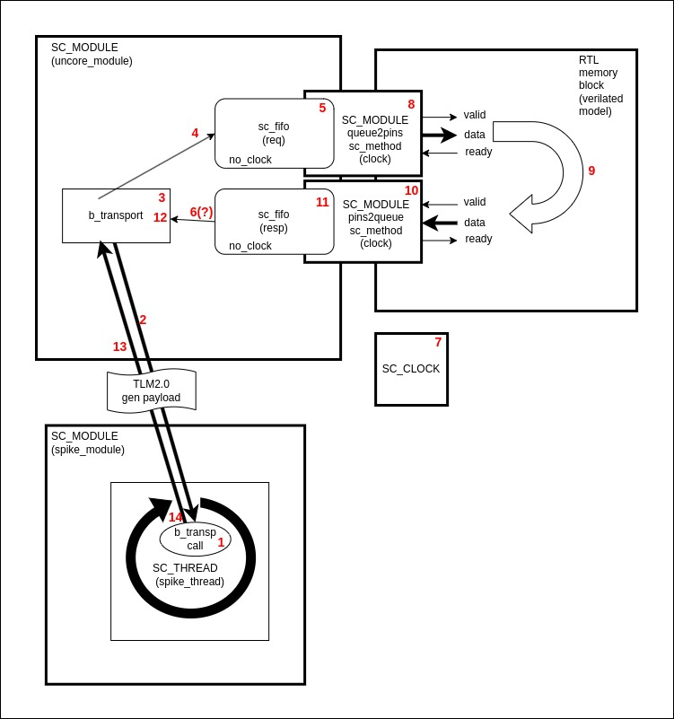

## This example shows a way of making an early model comprised of RISCV Spike ISS simulator coupled with Verilated RTL extensions.

The setup is comprised of the following blocks:

1. Spike module (RISC_V ISS simulator - master)
2. Uncore module (converts from TLM2.0 formed by spike to bus bit vectors)
3. TLM_to_RTL bus adapters (translate from event based queues to clocked pins)
4. Verilated RTL (pipelined memory block - slave)

### Spike to Uncore interaction:
Spike is a class. Spike_step is running in the forever loop inside SC_THREAD (spike_thread).
Spike is communicating with another module Uncore using tlm2.0 b_transport and using tlm_generic_payload.

Uncore implements b_transport callback that takes data from the tlm_generic_payload that spike provides, make transaction validity checks and forms req data bit vector which is mapped to physical bus protocol (like axi/amba).

Unocore b_transport make two blocking calls write.req and read.resp the the locally defined req sc_fifo and resp sc_fifo.

It shall be noted that the originator of these blocking write.req and read.resp calls is actually spike_step method that makes b_transport call. But as was mentioned spike is running in the spike_thread and therefore spike indirectly make calls to blocking write and read methods of sc_fifos defined in the uncore module.

This TLM2.0 approach make model engineers only work with TLM2.0 generic payload strcuture and to be isolated from the phycisal bus implementation.

### Uncore to RTL interaction (via TLM_to_RTL bus adapters)
There are TLM_to_RTL adapter called queue2pins and RTL_to_TLM adapter called pins2queue.
Uncore is based on event based simulation flow but it needs to interact with RTL so these convertors from sc_fifo queues to valid/ready hardware bus protocol with clock are required.
Queue2pins and Pins2queue are sc_methods sensitive to clock.

When uncore converts TLM2.0 transaction from spike it forms bus bit vectors and places them in the sc_fifo req queue there is a queue2pins module that runs on every clock event (SC_METHOD) and places data from the queue in the output pins of the valid/ready bus. If there is a stall in the RTL the data is not being taken from the queue. The logic is implemented as output registers and the sampling happens if (~down_valid || down_ready) - classic stall generator logic. This allows back-to-back data transfers providing downstream provides constant ready.

On the other side there is pins2queue module that samples data from pins and if there is a place in the queue it puts data on that queue check available remaining place and provide corresponding backpressure for the RTL. There is a one clock delay between check of the remaining place in the sc_fifo and the time when RTL will see this registered backpressure signal. To allow for back to-back transfers pins2queue converter has expansion register and acts as a skid-buffer.

*In this particular environment we don't have outstanding transactions as described later. But queue2pins and pins2queue support back-to-back transactions.*

## Transactions flow:

This diagram shows transaction flow:

1. Spike is running in the SC_THREAD so it can call blocking functions (in our case not directly though bu b_transport that will call b_transport callback in the uncore and in the uncore blocking write and read interactions with sc_fifos).

