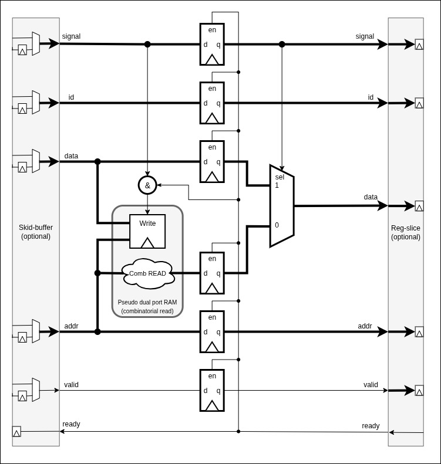
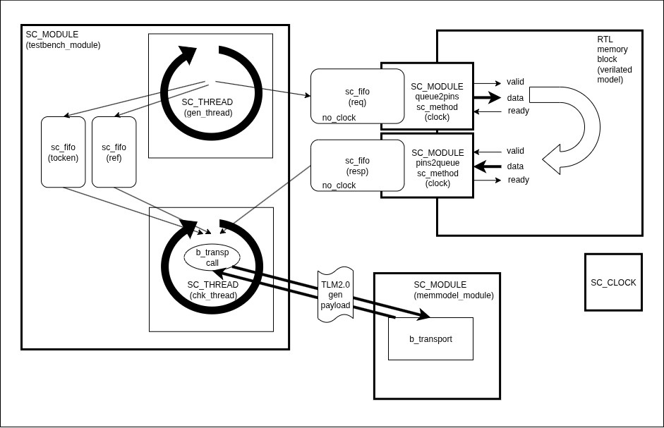

###SystemC testbench to compare Verilated RTL block (memory block) with "golden reference model".

Keywords: AXI, TLM2.0, Verilator, SystemC, SCV.

The main purpose of this testbench is to verify and proof the following concepts/components:
1. Verify functionality of a pipelined RAM module by comparing RTL model with the TLM2.0 "golden reference model".
2. Verify functionality of PIN-to-TLM bridges.
3. Verify that Verilated RTL model is properly connected with transaction level SystemC testbench.
4. Verify that PIN-to-TLM bridge (pins2queue) works as flow-control element for RTL pipeline.

##RTL memory block:
Let's consider the following RTL block which is pipelined random access memory.

The pipeline uses memory mapped transfers that comes as a single vector on the upstream interface and coming out from downstream interface.
This vector has the following fields throughout the pipeline:

*"signal" - needed to distinguish operations such as read or write,
*"id" - needed to identify master when interconnect (which is not present here has to route response back to the master),
*"data" - the actual data to be written or read,
*"addr" - the address of the transaction.

At the upstream side we have skid buffer to register "up_ready" signal.
At the downstream side we have reg-slice that registers data (comprised of "signal", "id", "data", "addr") and valid signals.
Skid-buffer and reg-slice also work as flow-control elements - i.e. drive pipeline (assert "up_ready" high) if there is space to buffer incoming data.

If there is no requirement to have all the outputs of RTL memory block registered we may not use skid-buffer and reg-slice at all.
In this case PIN2TLM adapter will act as a flow-control element that will provide ready for RTL as long as there is space in its queue.

##The testbench:

The testbench in addition to verifying functionality by comparing RTL output with TLM2.0 model of the RAM is also stressing the design in 9 modes (different speeds/delays of generator and checker threads, slow/random/fast).
This is to make sure that the backbressure from chk_thread propagates all the way back to gen_tread via "pins2queue", Verilated RTL model, "queue2pins".
Also we can verify on the timing diagrams that in case of the fast generator and fast checker we can observe back-to-back transfers.
Also the testbench can tell us that the design works (RTL pipeline keeps driven by "pins2queue" bridge) of we remove (skid-buffer and reg-slice from RTL).

